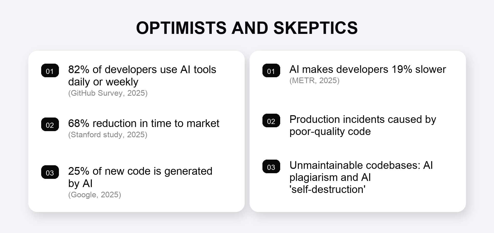
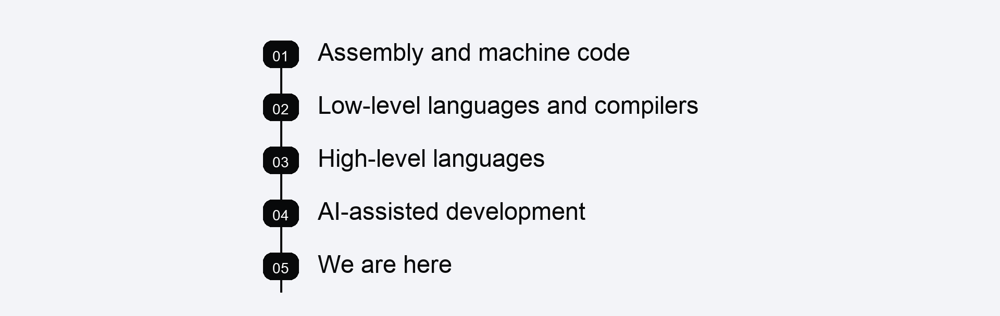
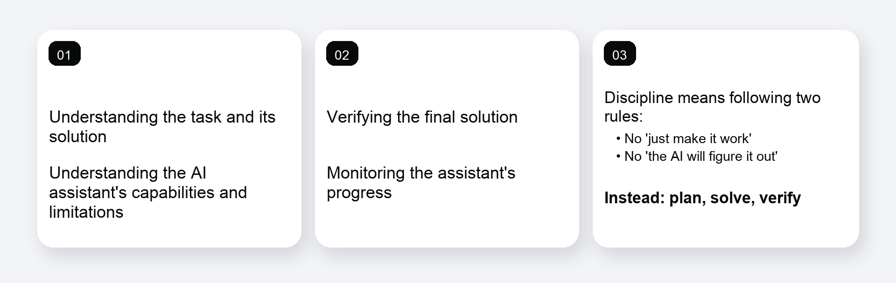
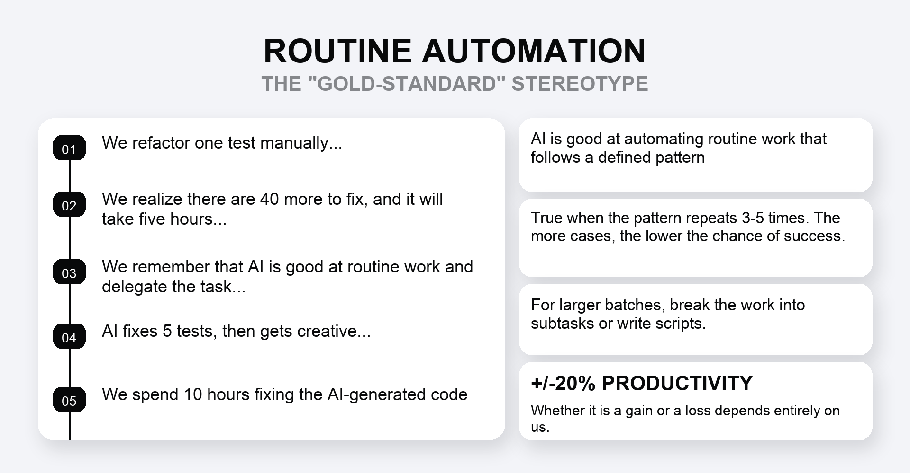
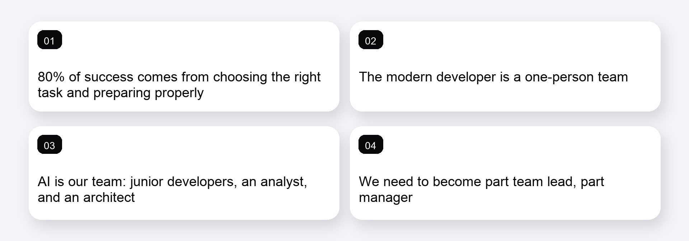

# Engineering Culture vs. Vibe Coding: How to Make AI Work for You

**Alexander Rodionov** 
Software Engineer at Yandex Go 
September 30, 2025 
Topics: ML, AI

If, like me, you follow the latest developments in software engineering, you have probably heard about the much-discussed METR study. It found that AI assistants made experienced developers almost 20% less productive. For anyone who sees the hype around AI as temporary, or even harmful, the study has become a powerful argument. I am not going to dispute its findings.

But what if we looked at them from a completely different angle? What if that loss could be turned into a major advantage and used to multiply our productivity?

The industry is now split into two camps. On one side are the optimists, who believe the future is already here and are ready to introduce AI everywhere, regardless of whether it makes sense. On the other are the skeptics, who believe we should simply wait for the storm to pass because, for now, AI does more harm than good.

My own position lies somewhere in between. I call myself an AI realist. I have been working with LLMs since 2022, when they first entered the mainstream, and I see them first and foremost as a new tool. A powerful and complex one, certainly, but still just a tool - one that can be used well or badly. In this article, I want to distill what I have learned about working with AI assistants so that they genuinely help rather than get in the way.

This is not about the currently fashionable idea of "vibe coding." It is about engineering culture and deliberate software development.

Before we move on to specific rules and pitfalls, however, let us take a step back. To use a new tool properly, we first need to understand its nature. Historical parallels are one of the best ways to do that, because they help reveal what we are actually dealing with.

## We Have Seen This Before, Just in a Different Form

Resistance to technologies that seem to take away people's jobs and devalue their skills is nothing new. Craftspeople once looked at factories with suspicion. Later, workers felt the same way about Henry Ford's assembly lines, and engineers about CNC machines. The concern was always the same: machines would replace people, and unique human expertise would give way to soulless automation.

For software developers, however, there is a much closer and more familiar parallel: the evolution of programming languages.

Think about the journey. We moved from machine code and assembly, where engineers controlled every CPU cycle, to low-level languages and compilers. Then came high-level languages, which abstracted away memory management and many other complex details. Every transition involved a trade-off. We deliberately surrendered some control and, perhaps, some peak performance. In return, we gained enormous development speed and made the profession more accessible.

The move toward AI-assisted development is simply the next step in that progression, and the trade-off is much the same. We can bring products to market faster, but we also face the risk of lower code quality.

I deliberately say *risk*, not *inevitable decline*. That risk can and should be managed. Just as we learned to write efficient code in high-level languages, we can learn to produce high-quality code with AI.

## The Two Words That Matter Most: Understanding and Control

These are more than abstract concepts. They are the foundation of effective and safe work with AI. Without them, even the most advanced assistant is likely to do more harm than good.

Let us look at what each of them means in practice.

### Understanding

Understanding is the preparation you do before writing even a single line of a prompt. It requires clarity on four things:

1. **Understand what needs to be done.** This may sound obvious, but it is critical. If you cannot clearly define the end goal and the expected outcome, you will reach it only by chance. AI cannot read your mind. It follows a specification, even if that specification is informal.

2. **Understand the best way to do it.** You should have at least one viable solution in mind, and ideally more than one. If you do not know how you would solve the problem yourself, you cannot properly assess the code suggested by AI, judge whether its approach is sound, or determine whether it has missed important details. You cannot effectively review code that you would not know how to write.

3. **Understand how to explain the task to AI.** This is the next level. You need to translate your own vision into clear, unambiguous instructions for the machine. If the assistant misunderstands you, it will generate something based on its own interpretation, which is often wrong. Once again, success becomes a matter of luck.

4. **Understand how you will verify the result.** How will you know that the task has been completed correctly? Will you write unit tests? Run a set of predefined manual test cases? Or simply launch the program and see whether it crashes? Success criteria should be defined before the work begins, not after the code has already been generated.

### Control

Control is what you do during the work and after it is complete. If understanding is preparation, control is execution and acceptance.

1. **Control the path to the solution.** Do not wait for the final result before you start checking the assistant's work. Use plans, task lists, or any other tools that reveal early on whether it is moving in the right direction. If you see that the AI is about to "rewrite the Linux kernel instead of refactoring your tests," stop it immediately rather than cleaning up the consequences later.

2. **Control the final result.** This is the familiar review stage. Assess the quality and architecture of the code, check the coverage of edge cases, and test it thoroughly. Generated code is not the final word. It is a draft that deserves the same rigorous scrutiny as code written by a junior developer.

3. **Exercise self-control.** This may be the hardest part. It takes discipline to follow the first two rules even when you do not feel like it. The greatest temptation is to fall back on "AI, just make it work" or to assume that "the AI will figure it out somehow." Trust me, it will not.

We are engineers. Our work has always followed a simple pattern: plan, solve, verify. That pattern does not change when we work with AI. It only becomes more important.

## Where AI Is a Friend and Where It Is an Enemy

Understanding and control give us a compass. Now let us map the main types of tasks so that we can see where the ground is solid and where the hidden traps lie. I see three key scenarios that everyone encounters when they begin using AI assistants.

### Automating Routine Work

Let us start with one of the most popular, and perhaps most misleading, beliefs: "AI will take care of all the routine work, leaving us free to focus on pure creativity." This is a textbook stereotype, especially from an employer's point of view. But if we accept it uncritically, we may spend far more time fixing AI-generated code than it would have taken to complete the task manually.

Imagine that you need to refactor a hundred nearly identical tests. It is tempting to feed all of them to the assistant in a single prompt. Why is that a bad idea? As the task and the number of repetitions grow, the model's context becomes bloated. This leads to artifacts, hallucinations, and the kind of excessive creativity where the assistant suddenly decides it knows better and starts rewriting something completely unrelated.

What should you do instead? AI is genuinely good at automating routine work, but in small doses. It can take a solution you have already implemented once and reliably repeat it in three, four, or perhaps five other places. If you need more than that, split the larger job into several smaller ones and reset the context between them. If you need far more, write a script. Incidentally, you can also use an assistant to write a script that has its own AI component, but that is a story for another day.

### Complex Business Logic

Now we enter the obvious danger zone. Everyone knows how risky it can be to entrust AI with critical code. Consider this headline: "In March 2025, a payment gateway created through vibe coding approved $2 million in fraudulent transactions because of inadequate input validation." It is a vivid example of what blind trust can lead to.

> The most dangerous prompt is one that asks the assistant to think for you. That is not delegating a task. It is delegating your engineering judgment.

The obvious conclusion might seem to be that AI should never be allowed near business logic. But that would rule out some highly effective use cases. This apparent anti-pattern becomes a powerful tool when we return to our two core principles.

AI is very good at implementing complex logic, but only when that logic has already been designed and described in detail by you. If you have structured business requirements, a well-considered architecture, documented user stories, and clearly defined testing methods, in other words, a coherent vision of the final solution, the assistant can implement it extremely well. It can generate the scaffolding, which you can then develop into the finished implementation.

AI performs well on tasks that are relatively small but complex and well structured. This is partly because the model's context is limited, and partly because our own mental context is limited too. We are rarely able to hold a truly large system in our heads all at once.

### Safe and Effective Tasks

Finally, we reach the green zone, where even people who have already discovered every possible pitfall can work with confidence. These tasks have one of two characteristics: either the result is quick and easy to verify, or the cost of an error is very low.

Examples include:

- Writing boilerplate code.
- Generating complex class structures from a completed architectural design.
- Small, atomic refactoring tasks.
- Writing clients and adapters for an API.
- Creating utilities and helper scripts for automation.

In these cases, the assistant becomes an ideal helper. Either you can immediately see that something has gone wrong, or a potential bug will not cause serious harm and can be corrected easily.

These three categories do not, of course, cover every possible task. But they offer a useful framework for deciding what to delegate to AI and what to keep for yourself. That brings us to the most interesting question: how the developer's role is changing, and how we can overcome that 19% productivity loss.

## Turning a Loss into a Gain

We have now come full circle, back to the METR study and its 19% productivity decrease. How can we beat the numbers if AI makes us slower even on suitable tasks?

The answer is simple: we need to change not the tool, but our approach to work and the way we measure productivity. The problem is not that AI slows us down on a specific task. The problem is that we still think in terms of one task at a time.

This is the key. AI assistants are changing our role. We are no longer simply individual contributors. Each of us now has the opportunity to lead a virtual team of our own. We have AI junior developers, AI analysts, AI testers, and AI architects at our disposal. Managing them effectively inevitably requires us to develop the skills of a team lead and a manager.

In my view, as much as 80% of success in solving a task with AI depends on our preparation and our ability to manage the process.

This shift in mindset calls for a new working culture built around two simple actions:

- **Decompose.** If a task is too large and complex to describe to AI completely and unambiguously, break it down into smaller, understandable, controllable subtasks. Keep breaking it down until every individual task fully satisfies the principles of understanding and control.

- **Distribute.** This is the crucial step. Once you have these atomic tasks, let AI work on them. But do not sit and wait for it to finish. While it works on the first task, have it start on the second. Meanwhile, you can tackle a third task, one that specifically requires human intelligence.

This is how we move from sequential work to parallel execution. It is a skill that can be trained, and it depends on your ability to switch contexts. I am currently comfortable managing two or three such workstreams at once. Over time, that number will grow.

> The productivity of tomorrow's developer will be measured not by how quickly they write code, but by the throughput of their mind: their ability to manage several workstreams effectively at the same time.

We can now look at the productivity equation from a new angle:

**n x E_AI > E_human, for n > 1 and n in N**

This formula is deliberately simplified to illustrate the idea. A more honest way to put it is that our total productivity, the number of tasks (*n*) multiplied by our effectiveness with AI (*E_AI*), must exceed the productivity of a developer working without AI (*E_human*).

In other words, the number of parallel workstreams, *n*, must be sufficient to offset the loss of efficiency on each individual task. If an assistant makes you 20% slower on a task, then handling two tasks at once is already enough to break even. To achieve a meaningful gain, you need three or more.

This is a limitation of the approach, but it also reinforces the main point: what matters is not how fast you type code, but how effectively you manage the flow of work.

A developer using AI to solve several tasks in parallel ultimately becomes more productive than a developer without AI who is focused on just one. You become a one-person team, perhaps even a one-person department. That completely changes the rules of the game.

Of course, an attentive reader will notice that this approach requires enough skill with AI to avoid losing too much efficiency on each individual task. That is true. It is also further proof that AI is simply a powerful new tool that must be learned, not a magic "make it good" button.

## AI-Assisted Development, Not Vibe Coding

Ultimately, AI is not a replacement for engineers. It is a new tool that we can use to become more effective. But for that to happen, we will need to change too.

In this new reality, the developer's most important skills are not so much writing code as decomposing tasks, producing clear technical specifications, and critically evaluating the results. We will all need to acquire some of the skills of managers and team leads to make effective use of this new toolkit.

Our challenge today is neither to deny that the future has arrived nor to place blind faith in AI's omnipotence. Our challenge is to be realistic: to use the opportunities the technology offers right now while remaining clear-eyed about its limitations.

That is the difference between chaotic vibe coding and professional AI-assisted development. The first is a game of roulette in which you hope to get lucky. The second is a deliberate engineering process built on understanding and control. Only the latter can deliver a genuine increase in productivity.

---

English translation of the article originally published in the Yandex Urban Services engineering blog.
