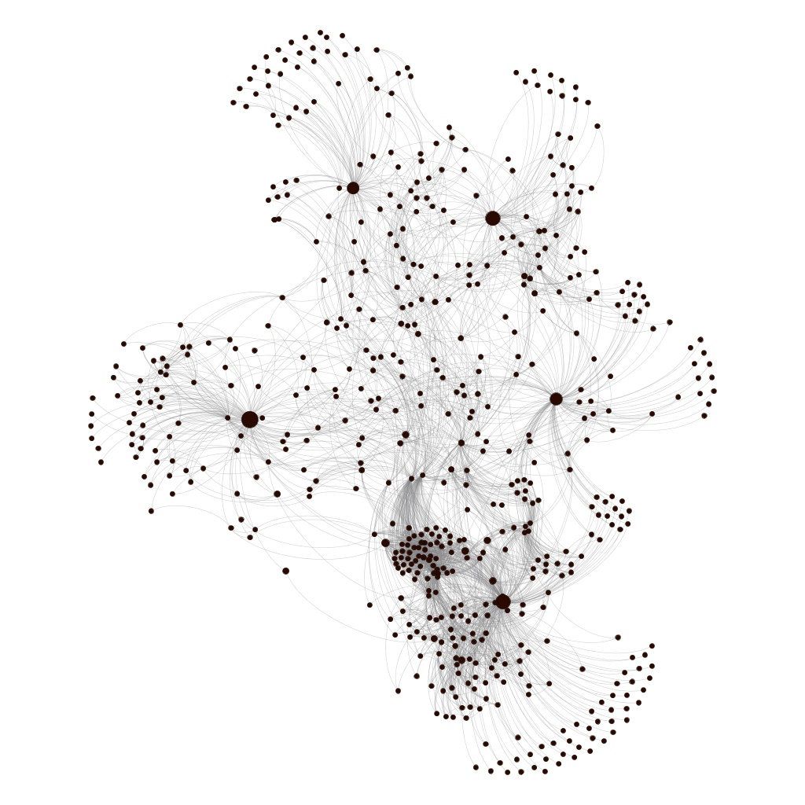
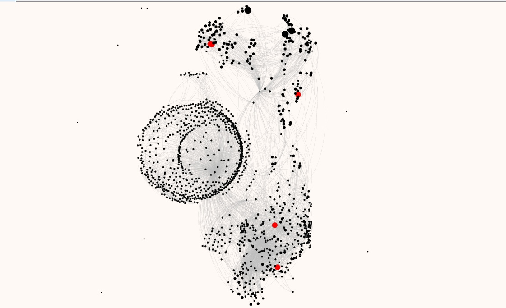

# Graph-Based Methods for Identifying Semantically Significant Judicial-Decision Texts

Unofficial English translation by Alexander Rodionov.

Original authors: Vasily Vasiliev, Alexander Rodionov, Anastasia Gracheva, Ivan Blekanov.

Originally published in *Control Processes and Stability*, 2019, Vol. 6, No. 1, pp. 234–239.

Published with the co-authors’ permission. This translation has not undergone separate peer review.

UDC 519.173

## Abstract

This paper develops methods for identifying semantically significant documents in a corpus of judicial decisions for information-retrieval purposes. It describes the construction of a citation graph from legal texts and the network metrics used to analyze that graph. The proposed model was evaluated experimentally, with legal experts assessing the results of its semantic analysis. The study culminated in a software package for retrieving semantically significant documents from corpora of judicial decisions.

## 1. Introduction

Legal informatics, a relatively young field of research, has developed rapidly over the past several years. Researchers first turned their attention to computer-assisted retrieval of legal information in the mid-1960s [1].

A number of legal information systems are currently available [2, 3]. They help legal professionals search for information and monitor changes in legislation and legal practice. These systems, however, do not provide sufficiently comprehensive semantically significant information for legal professionals. In particular, they are designed to improve the search and analysis of legal practice but do not address the challenges of maintaining legal certainty, improving the legal system, and managing legislative inflation [4].

These challenges can be addressed through approaches that identify and analyze semantically significant relationships within corpora of judicial decisions. Using such relationships in judicial information retrieval makes it possible to find not only references to known provisions of statutes and regulations, but also information relevant to the factual circumstances of a case [5]. Existing legal information systems have limitations and do not fully solve the problem of identifying semantic relationships between legal documents [6].

This paper presents a software tool designed to retrieve semantically significant texts from a corpus of judicial decisions.

## 2. Methods

Consider citation-closed sets of legal documents. Here, a *citation* means that one document contains a reference to another document in the same set. Each such set is represented as a directed graph using the method described in [7]. Network analysis provides several ways to use citations to determine which nodes are the most central and authoritative in a network [7, 8]. This study considers metrics that capture a substantial share of the information contained in a citation graph and thereby yield better relevance estimates for judicial decisions: betweenness centrality and closeness centrality [8].

The two metrics are expressed below in standard notation. For betweenness centrality,

<i>C</i>B(<i>v</i>) = ∑<i>s</i>,<i>t</i>∈<i>V</i> σ(<i>s</i>,<i>t</i> | <i>v</i>) / σ(<i>s</i>,<i>t</i>). &nbsp;&nbsp;&nbsp; (1)

Here, *v* is the vertex for which the metric is calculated, *V* is the set of all graph vertices, σ(*s*, *t*) is the number of shortest paths between vertices *s* and *t*, and σ(*s*, *t* | *v*) is the number of those paths that pass through a vertex *v* distinct from *s* and *t*. If *s* = *t*, then σ(*s*, *t*) = 1; if *v* ∈ {*s*, *t*}, then σ(*s*, *t* | *v*) = 0.

Closeness centrality is defined as

<i>C</i>C(<i>v</i>) = (<i>n</i> − 1) / ∑<i>u</i>∈<i>V</i>, <i>u</i>≠<i>v</i> <i>d</i>(<i>v</i>,<i>u</i>). &nbsp;&nbsp;&nbsp; (2)

Here, *v* is the vertex for which the metric is calculated, *n* is the total number of vertices in the graph (*n* = |*V*|), and *d*(*v*, *u*) is the shortest-path distance between *v* and *u*.

Classical centrality measures such as degree, in-degree, and out-degree are not considered because they have shown limited effectiveness in the analysis of judicial-decision texts [9].

Betweenness centrality was selected because it measures the extent to which a graph node participates in the transfer of information between other nodes. When the graph is stratified by document publication date, betweenness makes it possible to identify documents that interpret a substantial proportion of previously issued documents [10].

Closeness centrality additionally identifies documents that directly or indirectly influence a substantial proportion of the other documents in the underlying set [10].

On the basis of these centrality measures, the authors developed a Python software package [11] for constructing and visualizing the semantic relationship graph of a corpus of judicial decisions.

## 3. Experiment

The experiment used the software package [11] to collect decisions issued between 1995 and 2018 from the official website of the Constitutional Court of the Russian Federation [12] and to analyze the resulting corpus. In particular, the two centrality measures were used to identify the 30 most semantically significant documents in the corpus under each metric. The results were then visualized as directed relationship graphs for those documents.

## 4. Results

The collection process yielded 31,658 judicial decisions. The resulting semantic relationship graph contained 31,658 vertices and 69,925 directed edges.

Figure 1 visualizes the betweenness-centrality results, while Figure 2 presents the closeness-centrality results. In both figures, the five most significant documents according to the corresponding metric are shown as large nodes.

<figure class="paper-figure">
  
  <figcaption>Figure 1. Betweenness centrality.</figcaption>
</figure>

<figure class="paper-figure">
  
  <figcaption>Figure 2. Closeness centrality.</figcaption>
</figure>

A sample of 60 judicial decisions with the highest betweenness and closeness values was reviewed by legal experts. The experts were asked to assign the decisions to one of three categories:

1. A decision significant to legal practice that contains a new legal position.
2. An ordinary decision that reiterates a legal position previously expressed by the court.
3. An insignificant decision that contains no legal position of practical value to a legal professional.

The presence or absence of a legal position in a decision was therefore selected as the criterion for assigning that decision to one of the three categories. This choice reflects the fact that the value of information to a legal professional varies with context, including the problem under consideration and the circumstances of the case. A *new legal position* was understood to include a new formulation of an existing position that either clarifies its earlier meaning or expands its semantic scope by extending its legal effect to new social relations.

The expert assessment found that, among the 30 decisions with the highest betweenness values, four belonged to category 2 and the remaining 26 to category 1. Among the 30 decisions with the highest closeness values, 29 belonged to category 1 and one decision containing no legal position belonged to category 3.

The method therefore identified judicial decisions that were significant to legal practice by virtue of the legal positions they contained, with only a small proportion of deviations from the expected result.

## 5. Conclusion

The rapid development of network-analysis methods and advances in legal-informatics software make it possible to automate the retrieval of judicial decisions relevant to legal practice.

By constructing and identifying semantically significant relationships within a corpus of judicial decisions, the software package developed in this study [11] retrieves the most relevant documents issued by the Constitutional Court of the Russian Federation. The graph-based methods introduced in this paper reveal relationships between judicial decisions and thereby improve legal information retrieval. The absence of uniform drafting conventions across judicial authorities—particularly the lack of strict rules for citing legal positions—nevertheless affects the proportion of deviations. This limitation was taken into account during the expert assessment.

Future work will focus on optimizing the proposed graph-based methods: increasing query-processing speed and reducing the time required to calculate centrality measures for large and very large graphs.

The software package [11] was released under the [Apache License 2.0](https://www.apache.org/licenses/LICENSE-2.0) for unrestricted use as a standalone web application for retrieving and analyzing judicial-decision texts.

## References

1. Kerimov, D. A. *Freedom, Law, and Legality in Socialist Society*. Moscow: Yuridicheskaya Literatura, 1960. 223 pp. (In Russian.)
2. ConsultantPlus. *Legislation of the Russian Federation: Codes, Laws, Decrees, Government Resolutions, and Regulations*. [Online resource](http://www.consultant.ru/). Accessed March 10, 2019. (In Russian.)
3. GARANT. *Legislation of the Russian Federation: Codes, Laws, Decrees, and Resolutions; Analysis, Commentary, and Practice*. [Online resource](http://www.garant.ru/). Accessed March 10, 2019. (In Russian.)
4. Decree of the President of the Russian Federation No. 657 of May 20, 2011, “On Monitoring the Application of Law in the Russian Federation.” *Rossiyskaya Gazeta*, 2011, no. 110, art. 5486. (In Russian.)
5. Turnbull, D., and J. Berryman. *Relevant Search: With Applications for Solr and Elasticsearch*. New York: Manning Publications, 2016. 360 pp.
6. Chubukova, S. G., T. M. Belyaeva, A. T. Kudinov, and N. V. Palyanova. *Legal Informatics: A Textbook and Practicum for Applied Bachelor’s Programs*. 3rd ed. Moscow: Yurait, 2018. 314 pp. (In Russian.)
7. Bredikhin, S. V., V. M. Lyapunov, N. G. Shcherbakova, and A. N. Yurgenson. “Centrality Parameters of Nodes in a Scientific-Paper Citation Network.” *Problems of Informatics*, 2016, vol. 30, no. 1, pp. 39–57. (In Russian.)
8. Shcherbakova, N. G. “An Axiomatic Framework for Centrality in Complex Networks.” *Problems of Informatics*, 2015, vol. 28, no. 3, pp. 3–13. (In Russian.)
9. Fowler, J. H., T. R. Johnson, J. F. Spriggs, et al. “Network Analysis and the Law: Measuring the Legal Importance of Precedents at the U.S. Supreme Court.” *Political Analysis*, 2007, vol. 15, no. 3, pp. 324–346.
10. Federal Judicial Center. *Judicial Writing Manual: A Pocket Guide for Judges*. 2nd ed., 2013. [PDF](https://www.fjc.gov/sites/default/files/2014/Judicial-Writing-Manual-2D-FJC-2013.pdf). Accessed March 10, 2019.
11. Judyst WebProject source code. [GitHub repository](https://github.com/robot-lab/judyst-main-web-service). Accessed March 10, 2019.
12. Constitutional Court of the Russian Federation. [Official website](http://www.ksrf.ru/). Accessed March 10, 2019.
