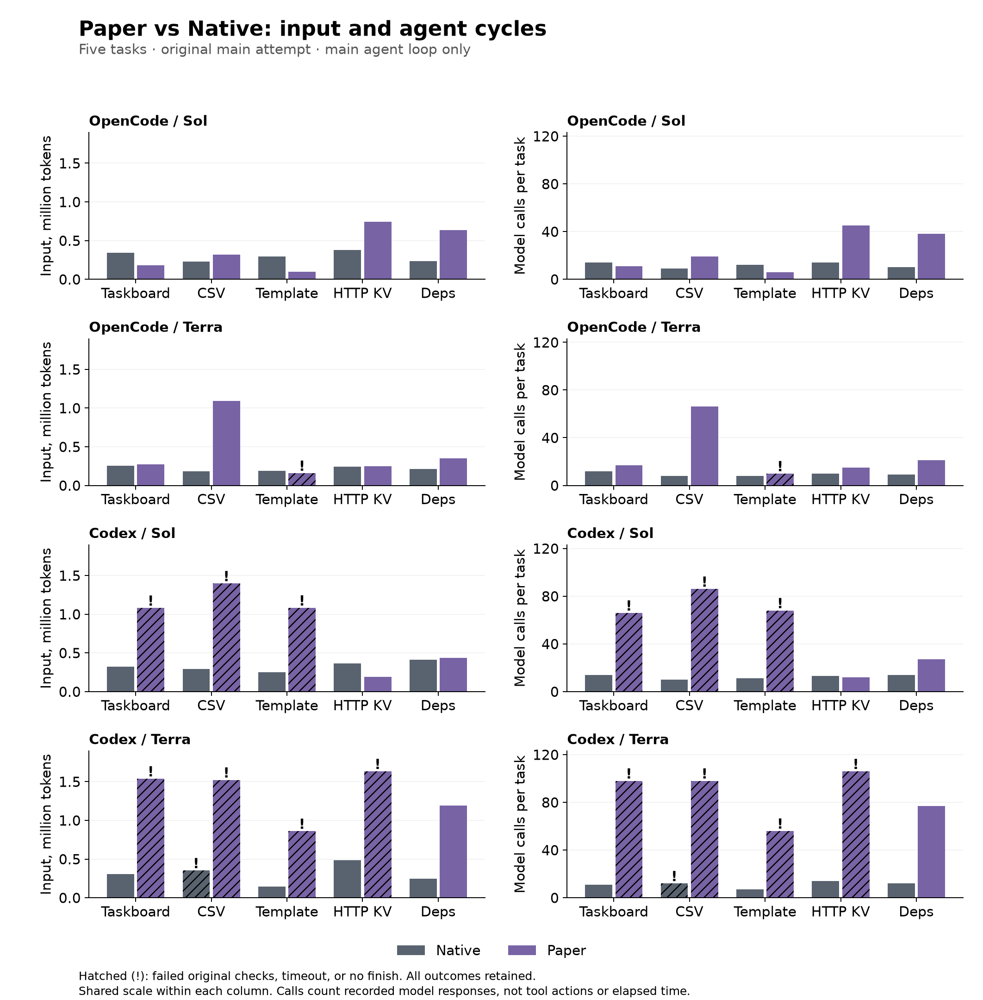
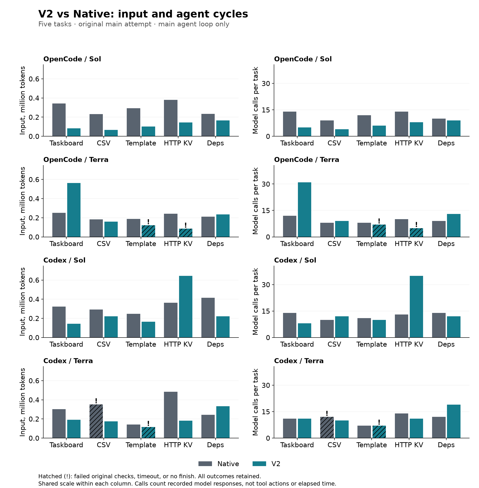
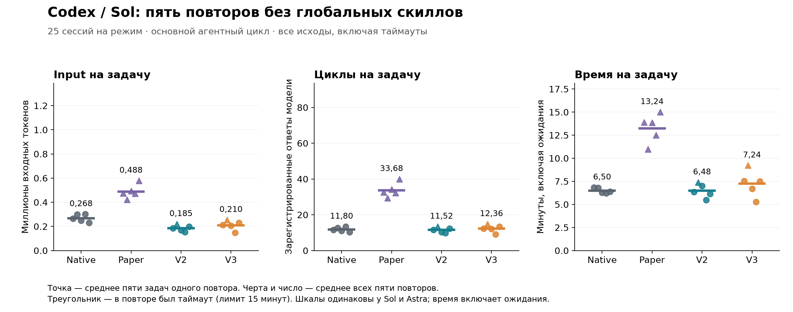
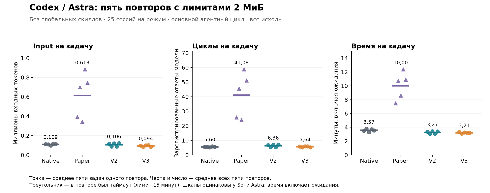
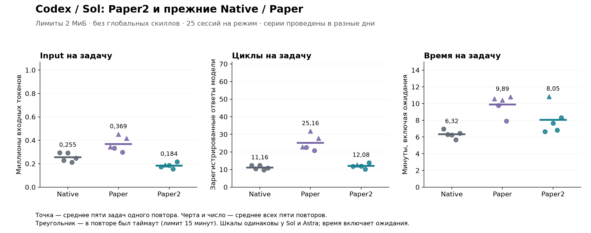
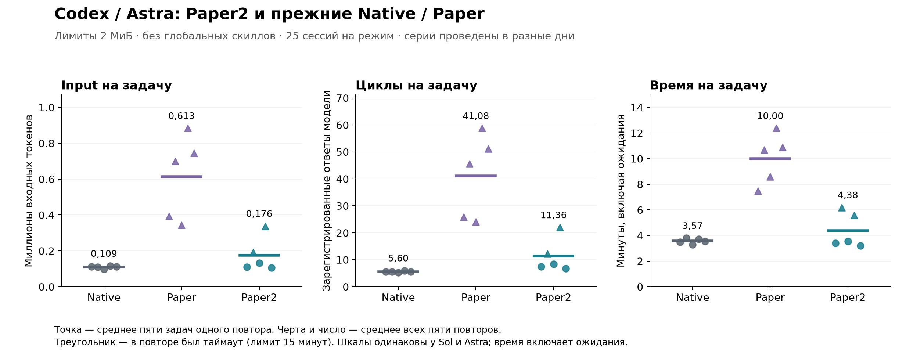
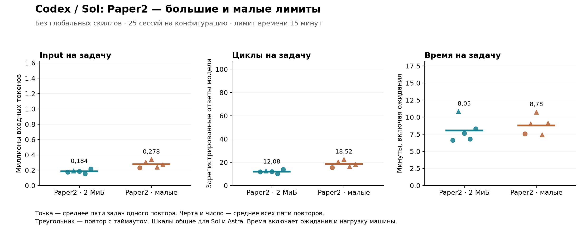
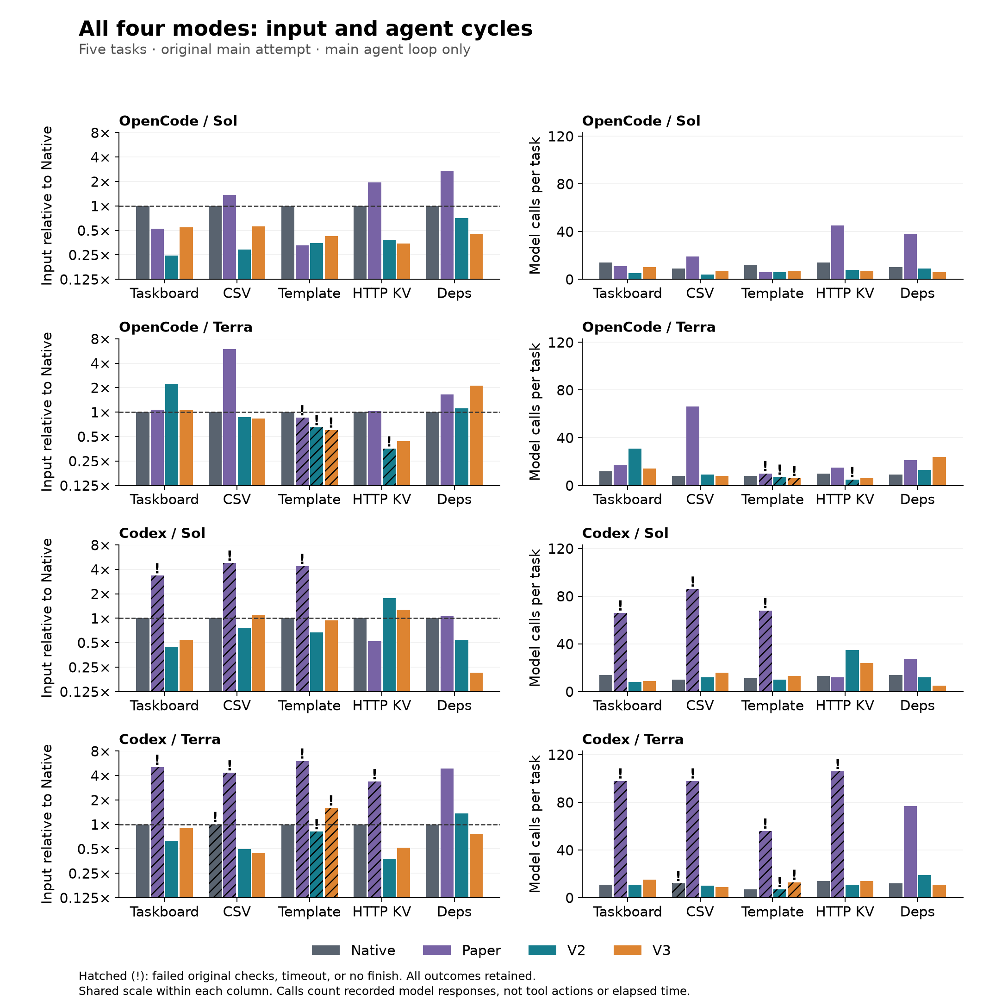

# SKILL.state in Coding Agents: Less History, but Not Always Less Work

## What this article is about

This is the story of my experiment: what I wanted to try, how it turned out, and where I had to
reconsider my expectations. I am not trying to teach anyone here or prove the right way
to organize agent memory. I simply wanted to share the experience—with the results,
mistakes, and questions I still cannot answer.

## How it all started

I recently came across [SKILL.state: Scalable Long-Horizon Agent Skills](https://arxiv.org/abs/2608.26263),
and its idea caught my attention: what if an agent does not need the entire history of its work and reasoning to choose
its next action? Instead, it could keep an explicit execution state and build each new request
around it.

I had worked with a similar architecture before: a combination of a state machine and an LLM workflow, where individual nodes were
full-fledged agents with their own work cycle, or agent loop. But each of them handled a fairly narrow class of tasks.
It had never occurred to me to apply the same principle to an agent that writes code on its own.
So I wanted to try bringing the idea to life.

I decided to apply the general idea of SKILL.state to the autonomous development
of software projects. I used two open-source coding agents as a foundation—OpenCode and Codex—
because I wanted to see how much the result depended on the agent's own design.
I was curious about how this kind of memory would behave within a familiar work cycle: the agent receives
a specification, creates files, runs checks, fixes errors, and decides when the work is done.
One caveat up front: this is not a replication of the authors' experiments, but an attempt to apply their concept in a different environment.

First, I adapted the protocol and integrated it into the cores of both agents so that each new request would be built
from state, rather than accumulated history. Then, after looking at the first runs, I decided to refine the approach a little based
on my own experience: add memory of recent actions and, later, the ability to perform multiple
actions between model calls. These became the variants I call V2 and V3 below.

Along the way, I had to investigate both model behavior and bugs in my own implementation, and some
initially encouraging results looked less convincing on repeated runs.
That is what this article is about—for now, an account of engineering experience with publicly available code and logs, which I
hope to develop into a research study.

## What the authors of the original paper proposed

SKILL.state proposes organizing an agent's work so that its context does not grow with every step.
The authors consider long-running tasks in which an agent reasons, calls tools,
and interacts with an environment—in plain terms, does work. Software development is mentioned as one application,
but the architecture itself is not specific to coding agents. [The paper's problem statement](https://arxiv.org/html/2608.26263v2#S1).

In a conventional agent loop, reasoning, commands, tool responses,
and then more reasoning are gradually added to the original task. If history accumulates without compression and each step
adds roughly the same amount, context grows linearly. But we send it again at every step, so total input-token
usage grows quadratically. SKILL.state proposes building each request from three parts instead of all that history:

```text
P the fixed task definition
Σₙ the current structured state
Oₙ the latest environment observation
```

In response, the model must return a state change—a patch—and the next action. The agent's execution component,
or runtime, validates and applies this patch, performs the action, and returns an environment observation.
On the next step, previous reasoning and old tool responses are no longer included in the request:
if any of that information will be useful later, the model must save it in state itself.

This division of responsibilities is exactly what appeals to me. The program maintains the structure of the state and executes
commands, while the model decides what is worth remembering. Its choices determine what information the agent
will have as it continues and what it will have to request again.

There is a condition attached to these savings, though: everything needed to continue the work must fit
within the bounded state and observation. Only then does the input per step stop growing along
with the history. If an important detail is lost, the agent will have to recover it, which means additional
steps. When writing code, there may be enough of those steps to offset the benefit of shorter requests.
That is exactly what I encountered in the first experiments.

The experimental part of the original paper covers several different environments. It includes a synthetic
warehouse, a repository simulation with branches, PRs, and CI statuses, InterCode CTF terminal tasks, and customer
service in τ-Bench. The repository simulation tests the management of interrelated state, while CTF tests finding flags
through commands and hypothesis testing. These scenarios are adjacent to software development, but they are still not the same as
autonomously building an application from a specification. [Benchmark descriptions](https://arxiv.org/html/2608.26263v2#S4).

In the authors' synthetic warehouse management experiment over a horizon of 200 steps, SKILL.state used about
122,000 tokens versus 2.61 million for ReAct
([Table 1](https://arxiv.org/html/2608.26263v2)). The difference is impressive, but assuming it would carry over to an agent
that writes code would have been too bold. I wanted to see how much of that saving
would remain on our tasks and whether an agent with this kind of memory could finish the development work.

## How I tested the idea

I started with an OpenCode plugin, but soon ran into a limitation: the plugin required the model to take extra
actions to work with memory and could not guarantee that it would produce a patch together with an action at every step.
That made it a different experiment, so I had to move the mechanism into the core.

In the core implementation, the task and state are included in the request from the start: the model does not need to read a memory file separately.
The history is still kept in the logs—it is needed to analyze runs—but is not sent back to the model
in state modes. The working directory is preserved too, so the agent can reread files it has created
using its standard tools. If you are interested in the code, you can start with the
[OpenCode state builder](https://github.com/Rexarrior/skill-state-research/blob/main/opencode/packages/opencode/src/session/skill-state.ts) or the
[Codex state core](https://github.com/Rexarrior/skill-state-research/blob/main/codex/codex-rs/core/src/skill_state.rs).

Early trials, including those with GLM-5.2 and Luna, remain [in the general log](https://github.com/Rexarrior/skill-state-research/blob/main/journals/README.md).
For this article, I started with a separate comparison on OpenCode and Codex, then continued experimenting
on Codex: I added repeats, removed global skills, and tested larger memory limits.
This resulted in several series. Below, I first describe what they have in common, then how they differ.

For the experiment, I chose five small projects:

- a [CLI task manager](https://github.com/Rexarrior/skill-state-research/blob/main/experiments/skill-state/projects/taskboard-cli/SPEC.md) that persists data in JSON;
- a [CSV analysis utility](https://github.com/Rexarrior/skill-state-research/blob/main/experiments/skill-state/projects/csv-insights/SPEC.md);
- a [small template engine](https://github.com/Rexarrior/skill-state-research/blob/main/experiments/skill-state/projects/mini-template/SPEC.md);
- an [HTTP key-value service](https://github.com/Rexarrior/skill-state-research/blob/main/experiments/skill-state/projects/http-kv/SPEC.md);
- a [dependency planner](https://github.com/Rexarrior/skill-state-research/blob/main/experiments/skill-state/projects/dependency-planner/SPEC.md).

For each run, the agent receives the full specification and an empty working directory, then works independently.
An external [evaluator](https://github.com/Rexarrior/skill-state-research/blob/main/experiments/skill-state/scripts/evaluate.ts) checks the resulting project.
Its code was not added to the context and was stored outside the agent's working directory—although that alone
does not prevent the agent from reading the file. In one of the early runs, I even caught the model trying
to peek at the evaluator. After I clarified the working directory, this did not happen again,
but that measure can hardly be called full isolation.

There are 40 checks across the five projects. These should not be confused with 40 independent tasks:
for example, a single bug in saving the database may cause several checks to fail.
A full score means that the project passed our tests. Bugs beyond their coverage may well have remained.
Nor are we evaluating code quality in the broader sense here: we check whether the program does what it is supposed to do.

The main series compare four modes; one more control, Paper2, was added at the end.
V2/V3 and Paper2 are working names for my variants; they have nothing to do with the version names of the original paper:

| Mode | What the model sees from previous work | What it proposes per model call |
|---|---|---|
| Native | The agent's standard conversation history | Standard tool calls / Code Mode |
| Paper | Current Σ and the latest result O | A patch and one action |
| Paper2 | Current Σ and one O: the action, its arguments, status, and result | A patch and one action, as in Paper |
| V2 | Current Σ and three structured observations | A patch, an optional comment, and one action |
| V3 | Current Σ and three batch observations | A patch, an optional comment, and an array of actions to execute sequentially |

## A detailed description of the experiments

<spoiler title="More on the experiments and run conditions">

Here is the full set of experiments whose results appear in this article. Every series used
all five projects; all compared four modes, except for the first additional round of V2/V3
and the last two Paper2 series.

| Series | Agent and models | Attempts per project and mode | Runs |
|---|---|---|---:|
| Initial comparison | OpenCode and Codex, Sol and Terra | 1 | 80 |
| First additional V2/V3 repeats | Codex, Sol and Terra | 2 more, V2 and V3 only | 40 |
| Extended repeat series | Codex, Sol | 10 | 200 |
| No global skills, previous limits | Codex, Sol | 5 | 100 |
| No global skills, previous limits | Codex, Astra | 5 | 100 |
| No global skills, limits up to 2 MiB | Codex, Astra | 5 | 100 |
| No global skills, limits up to 2 MiB | Codex, Sol | 5 | 100 |
| Paper2, no global skills, limits up to 2 MiB | Codex, Sol and Astra | 5, Paper2 only | 50 |
| Paper2, no global skills, small limits and JSON safeguards | Codex, Sol and Astra | 5, Paper2 only | 50 |
| **Total** | | | **820** |

Each attempt to solve one project is a separate run; there are 820 in this article. For example,
five repeats of five projects in four modes produce 100 runs. The first two rows of the table make up
the main series of 120 runs: it contains three attempts for each Codex V2/V3 combination, including the initial comparison,
and one for each of the other combinations. The subsequent series add another 700 runs.
The tasks stay the same throughout: there are many repeats, but still only five different specifications.
Five attempts interrupted for technical reasons during the initial Paper2 execution are accounted for separately: they are included
neither in these 820 final outcomes nor in the reported usage. Below, I explain why the series had to be resumed.

The source code and settings were fixed before each series. The results below are shown separately
so that the conditions under which they were obtained remain visible; there is no overall average across all versions here.

I intended Paper mode as an implementation of the paper's architecture, but integrating it into the agents' cores
required departing from some details. It therefore did not become a literal copy of the authors' environment.
To retain the agents' standard tools, this implementation uses a
`skill_step` call with a typed action instead of a JSON block containing a command string. The state schema is also our own, shared by all five tasks:
for example, the authors' CTF schema has a separate `cmd_summary` field, which ours does not.
In the first series, the limits were 32 KiB for state and 4 KiB for an individual result.
Later, I tested a variant with larger limits—we will get to that—but I have not yet tested the individual effect
of each limit or of the schema itself. This is a significant caveat:
not every problem with our adaptation can be attributed to the idea of SKILL.state itself.
The [initial conformance audit](https://github.com/Rexarrior/skill-state-research/blob/main/experiments/PAPER-CONFORMANCE.md) describes the implementation and conditions
of the main series of 120 runs. I kept it as a historical document and discussed later changes to the limits,
isolation, and state persistence in an [audit addendum](https://github.com/Rexarrior/skill-state-research/blob/main/experiments/PAPER-CONFORMANCE-20260910.md).

Sol and Terra were used in the initial comparison and the additional V2/V3 repeats; subsequent series used Sol and Astra.
In every series, each attempt to solve a project was allowed 15 minutes.
Within each comparison, the model and general resource limits remained unchanged: Codex used
medium reasoning, while OpenCode used temperature 0 and a limit of 80 steps. The number of model calls was reconstructed from completed
OpenCode steps and Codex token-usage records; individual network retries are not included in this count.
Given these differences in settings, I compare variants within each agent, rather than absolute OpenCode usage
against Codex usage. The later Codex series retained medium reasoning and the k=3 window for V2/V3;
Paper still received only the latest observation. These experiments do not support conclusions about transfer to other
model families.

The integration into the core also differs. In what follows, I therefore compare complete working configurations,
rather than just memory formulas in an otherwise identical environment.

The first series ran on an already configured workstation. Despite
disabling the user CLI configuration, global skill headers
and MCP instructions remained in Codex's initial context. To be honest, I simply forgot about them. I had no intention of using them for these
tasks, but that does not mean they had no effect on the model.
In the published logs, this context has been replaced with markers stating the size of the removed portion.

In those state-based runs, the additional instructions went into P with textual role labels,
while Native retained separate message roles. The
[initial-context fingerprints](https://github.com/Rexarrior/skill-state-research/blob/main/experiments/article-20260904/host-context-audit.json) have been preserved for inspection.

To do more than merely acknowledge this caveat, I ran another series
on Sol to clean up the experiment: I temporarily removed the global skills and instructions, then restored them after the runs.
Astra appeared while I was experimenting, so I also ran the same tasks on it as a bonus.
These are the two series of 100 runs each in the table above. The Codex binary, specifications, and evaluator remained the same;
up to five main CLI processes ran concurrently. An inspection of the initial
messages in all 200 sessions found no markers for the skill catalog or global profile. This is still not full
OS-level isolation, but we did remove the specific contamination present in the earlier runs.

The Astra series had a technical interruption after 35 runs: a guard check stopped it because
an internal cache had reappeared, even though loading it had been disabled. After investigating the loader,
I corrected the check and ran the remaining 65 tasks without replacing or repeating those already completed.
The [conditions of both series and the adjustment to the run procedure](https://github.com/Rexarrior/skill-state-research/blob/main/experiments/codex-clean-comparison-20260908/README.md)
are documented separately. The new results below are also presented in separate sections: comparing them with the earlier Sol results
and attributing the entire difference to removing skills would be incorrect—timing, load,
and, of course, the path taken to a solution in each run all varied.

The next two series—another 100 runs each for Astra and Sol—test larger SKILL.state limits.
I raised four limits to 2 MiB each: the full state, accepted action arguments,
the saved copy of those arguments, and the result. I also fixed the repeated truncation of JSON when saving history.
Both models used the same
new build; temporary skill removal, the other settings, and concurrency remained unchanged.
Native was also rerun in these series so that each had its own comparison with the standard agent.
I discuss the changes and results in more detail below.

Finally, a follow-up audit raised a question about the contents of observation O itself. This led to Paper2:
50 runs each with large and small limits. I retained the JSON fix in the small-limit configuration,
so this was not a return to the old build with all its quirks. I primarily compare these series
with each other; comparisons with Native and Paper use earlier results, without new concurrent controls.

</spoiler>

## Checking the implementation before the comparison

<spoiler title="More on the bugs found and their fixes">

Before moving on to the charts, I want to explain what I had to fix in my own experiment.
The comparison series below began after the execution fixes listed in this section,
and all token-usage figures use the corrected accounting. That does not mean I had found
every problem by then: the repeated JSON truncation was discovered later, during the Astra experiments.
I indicate separately below which series included that fix. The early diagnostic runs helped
find bugs but are not included in the comparison tables.

It turned out that building requests as described in the paper was not enough. I also had to make sure the agent received the correct
tool responses, stopped when it should, and actually followed the protocol
we intended to study. Bugs turned up at every one of these levels.

### Completion without the required `finish`

In my implementation, Codex could stop working with an ordinary text response without ever calling the required
`finish` action. This happened, for example, in an early CLI project run with Sol/V2: the code passed 8/8 checks,
but the log contained no protocol-compliant completion. It deserved its points
for working code, but the whole run could not be considered a full success: we do not know how many more
model calls would have been needed if the core had required it to finish correctly.

I changed the loop's exit condition: an ordinary text response is no longer enough, and work continues
until an accepted `finish` or an interruption. The comparison series therefore account for code quality, process completion, and the
`finish` call separately. If the agent wrote a working project but then hit a timeout,
it keeps its code score but does not count as having completed successfully.

### A successful tool call does not necessarily mean a successful command

In V3, which I describe in more detail below, the model can propose several actions at once—a batch.
The intended behavior is for a failed action to stop the remaining ones, but both cores turned out to confuse
the success of a tool call with the success of the command itself. For example, a tool that runs tests may execute
perfectly normally and return a nonzero exit code: a result was obtained, but the tests failed.
If only the tool's status is checked, subsequent actions will run even though they should have been skipped.

After the fix, the command's exit code is taken into account too. On failure, the remaining actions are marked
`skipped`, so the model can see where execution stopped and decide what to do next. Changes already made
and the accepted patch are not rolled back. I fixed this violation of the execution rules,
although I did not establish that this particular bug had a noticeable effect on the results.

### Lost `apply_patch` confirmation

Another problem surfaced in the very first diagnostic Paper run on Codex. The adapter took the
`apply_patch` return value for Code Mode—an empty object `{}`—instead of the textual confirmation that files had changed.
The files could therefore already have been modified without the model receiving any message about it. The log showed repeated
attempts to create the same files, but drawing conclusions about SKILL.state from that would have been odd: it was our own code
that was losing the tool's feedback.

I fixed the result selection: for non-shell tools, the text output is now preserved,
while shell commands retain structured information about the exit code and process session. To prevent the bug
from recurring, I added a regression test using actual tool-result types.
I had to exclude this entire diagnostic series and restart the Codex comparison, including Native.
The original log was kept for investigating the bug, but even its successful runs were left out of the new series.

### The schema allowed a patch that the validator rejected

Paper also had a subtler inconsistency: the JSON Schema allowed the model to pass `null` for required
top-level fields. When the patch was applied, that meant deleting the field, and validation of the full state
then rejected the result. The model could therefore follow the proposed format in good faith and still
receive an error, then spend model calls repairing the patch instead of working on the task.

I aligned the response schema and instructions with what the core accepts. Required containers must now be preserved,
but their contents can still be cleared: an array can be replaced with `[]`, and an individual entry in the `files` dictionary
can be deleted with `null`. The principle itself has not changed—the model proposes a patch, and the runtime validates the resulting
state before executing the action.

### Incomplete accounting of OpenCode input tokens

Finally, I had to work out what the token counters actually meant. The old OpenCode reports summed
`input + cache.read`, even though the internal `input` excludes both cache reads and cache writes.
We were missing cache writes, which could distort both the savings percentage and the relative usage of the variants.
For this article, total input was therefore reconstructed as `input + cache.read + cache.write`.
Codex works differently: cached input is already included in total input, and adding it again would be a mistake.

Unlike the execution problems, this did not require calling the models again: all the necessary counters
were preserved in the logs and only needed to be summed correctly. For the same reason, there was no basis for excluding
the runs themselves. The [recalculation of the old tables](https://github.com/Rexarrior/skill-state-research/blob/main/journals/TOKEN-ACCOUNTING-CORRECTION.md) is documented separately,
and all the charts below already use the corrected metric.

The early experiments were useful, then: without them, some of these problems could easily have gone unnoticed.
For the main comparison of the current variants, however, I use a separate series of 120 runs. In that series, ordinary timeouts,
bugs in the generated code, and invalid model responses remain experimental results—they are not replaced
with successful attempts. Details of the [implementation checks](https://github.com/Rexarrior/skill-state-research/blob/main/experiments/article-20260904/VERIFICATION.md)
and the [rules for excluding diagnostic runs](https://github.com/Rexarrior/skill-state-research/blob/main/experiments/article-20260904/PROTOCOL.md) are documented separately.
The differences in schemas, tools, and initial context described above still remained;
the audit fixed specific bugs but did not make the comparison perfectly isolated.

</spoiler>

## Paper and Native: the first comparison

We can now look at the first comparison—Paper and the standard agent. Here and in the following paired charts,
the left side shows **cumulative input for the entire run**: how many millions of tokens the main agent loop received,
excluding the separate permissions reviewer. This is the total for a task, not a progression over steps; the primary attempt
is used for each task. Unsuccessful runs are marked with hatching and `!`: if checks failed, a timeout occurred,
or there was no `finish`, a short bar does not by itself mean a win.

The right side shows the number of model calls for the same task. In these figures, I use “step” or “cycle” to mean
a call for which a response from the main model was recorded, not an individual action: V3 can produce several actions at once,
and even an ordinary shell call may contain multiple commands. This counter helps show how many times the agent
had to return to the model and gives an indirect indication of runtime. Of course, runtime also depends on generation
length, tool execution, waiting, and load. I will show time separately in the section on repeats.



In most of these runs, Paper used more input tokens than Native, although there were examples of the reverse.
These results suggested taking a closer look at the contents of the observation.
Here is what I tried changing in the protocol.

## V2: expanding memory of past actions

In one of the early runs, Terra repeated `python3 -m py_compile main.py` 74 times.
When the command completed successfully with no output, the agent received an observation that did not reveal
what had just happened. A single log cannot establish the cause of the loop,
but it suggested where to look: was our O giving the model enough information?

It is important here to distinguish the authors' proposal from our adaptation. In the paper, O is the latest environment observation, and it
may well state which action was performed: in the authors' warehouse example, the response already describes the shipment.
It was our Paper adapter that passed only the tool result, without separately adding the command
and its arguments. That is where I started refining our adapter.

I replaced the result without context with a record roughly like this:

```json
{
  "action": {"name": "bash", "input": {"command": "bun test"}},
  "comment": "Check behavior after changing the parser",
  "status": "completed",
  "result": "12 tests passed"
}
```

The `action`, `input`, `status`, and `result` fields show what the agent did and what it received in response.
In `comment`, the model explains why it needs the action. This preserves both the command itself
and its intent between steps. The key is to avoid confusing the comment with the result: writing
“check that the tests pass” does not mean that a successful check has actually occurred.

The next step, however, changes the memory scheme itself: instead of one observation, I included
the three most recent records in the next request — `O[n−2], O[n−1], O[n]`. If information is needed
beyond this window, the model itself must move it into facts, decisions, or the description of completed work.
I also removed the separate `verification` field from the early adaptation to avoid keeping a parallel log of checks:
recent results are already visible in the observations, and important conclusions can be saved in the state.

The result was a small amount of short-term memory alongside the structured state. However, I changed
several things at once: the contents of an observation, the comment, and the window size. Understanding
the contribution of each will require separate experiments — ablations in which only one component changes.
Comparing V2 with Paper alone does not answer that question.



On OpenCode/Sol, this variant reduced input-token usage on all five projects, but the picture
is less uniform on the other configurations. That is why the chart retains the markers for failed runs:
looking only at the height of the bars would not be enough here.

## V3: several actions between model calls

By this point, it had become clear that a short context could require the model to use more cycles
to complete a task: Paper illustrated this particularly clearly. This is not an inherent property of every
state-based agent — V2 later managed fewer model calls than Native — but the possibility of losing
the savings to extra returns to the model worried me.

I tried adapting another idea from my own experience: reduce the number of cycles by allowing the model
to call several actions at once. Suppose the agent already knows which files it needs to create
and which command to use to check them. Why require it to return to the model after every action
if the model could describe the entire sequence it already knows in one go? That is how V3 came about.

The single action became an `actions` array:

```json
{
  "state_revision": 7,
  "state_patch": {"next_action": "Look at the test results"},
  "comment": "Create the files already identified and run a check",
  "actions": [
    {"name": "apply_patch", "input": {"patchText": "..."}},
    {"name": "bash", "input": {"command": "bun test"}}
  ]
}
```

This is an illustrative example — tool names and arguments differ between OpenCode and Codex — but the general mechanism is as follows:
the core checks the batch structure, state, action names, and basic argument types, applies the patch once,
and then executes the actions in sequence. Not all parameters are checked in advance, however: some checks
happen inside the individual tool. If an action fails, the remaining ones are marked
`skipped`; completing the work through `finish` requires a separate call, with no other actions in the batch.

The results are returned to the model when the batch finishes or stops on an error. An array like this therefore works
for a sequence known in advance, but it cannot replace reasoning between steps: the model cannot read unexpected
output from the first command and use it to choose the second within the same batch. That still requires
another model call.

There is also a subtlety with long-running commands: Codex can return the ID of a process that is still running,
which then needs to be polled through `write_stdin`. In other words, sequential tool calls
do not guarantee that all launched processes have already finished. A batch should not be treated as a transaction either:
if a later action fails, files already written and state changes already accepted will not be rolled back.

I did not set an upper limit on the number of actions: first, I wanted to see how the models would use batches.
In the initial experiments, the batches were small, with maxima of 5–7 actions. For now, this is an observation
rather than a reason to dispense with a limit forever: limiting the size of a single element does not limit the entire array.

Here, too, the factors are confounded. The V3 window stores **three batches**, not three actions, so both
the amount of work between LLM calls and the amount of recent memory available change.
Even if V3 wins, without an additional check we cannot tell how much of the gain came
from combining actions and how much came from a richer observation window.


The comparison with Native shows the result of the entire modification. To see what changed relative to
V2, let us look at the same runs with only this pair on the chart:


On some tasks, V3 was more economical than V2; on others, it was more expensive. But so far, there is only one attempt per task.
The Codex repeats changed that first impression considerably; below, I show both the first round of three attempts
and the subsequent ten repeats on Sol.

## Codex repeats

### First round: three V2/V3 attempts

The first result does not tell us what to expect from the next run, so I also repeated
the V2 versus V3 comparison on both models for Codex. The table shows total input across all five tasks in each attempt,
in millions of tokens, with the number of checks passed out of 40 in parentheses.
Alongside it, I give the number of main-model calls, counted in the same way as in the previous charts.
Calls to the permission reviewer and network retries are not included.

| Model | Attempt | V2: input, M tokens | V2: model calls | V3: input, M tokens | V3: model calls | V3 relative to V2: input |
|---|---:|---:|---:|---:|---:|---:|
| Sol | 1 | 1.397 (40/40) | 77 | 1.280 (40/40) | 67 | −8.4% |
| Sol | 2 | 1.273 (40/40) | 72 | 1.068 (39/40) | 56 | −16.1% |
| Sol | 3 | 1.065 (40/40) | 61 | 1.539 (40/40) | 81 | +44.5% |
| Terra | 1 | 1.000 (39/40) | 58 | 1.092 (39/40) | 62 | +9.2% |
| Terra | 2 | 1.696 (40/40) | 96 | 1.476 (39/40) | 81 | −12.9% |
| Terra | 3 | 1.039 (39/40) | 60 | 1.338 (39/40) | 75 | +28.8% |

These are still the same five tasks, each performed three times. Native, Paper,
and all OpenCode variants still have only one attempt each in this initial series.

This is where the initial impression of V3 changes. On Sol, it reduced main-model input in two out of three
attempts; on Terra, in one. But across all three attempts combined, it required more input tokens:
4.0% and 4.6% more, respectively. It also trailed slightly on checks: Sol achieved 119/120
versus V2's 120/120, and Terra achieved 117/120 versus 118/120. This is too little for a confident statistical
comparison of quality, but enough to avoid declaring V3 a consistent improvement based on one successful run.

The expectation about the number of cycles was only weakly borne out, too: on Sol, V3 made 204 calls versus V2's 210,
a reduction of just 2.9%. On Terra, there was no reduction at all — 218 versus 214.
Counterintuitively, at least to me, the ability to do more actions at once does not necessarily
mean fewer returns to the model over the entire task.

### Ten more Sol repeats: now all four variants

To examine the variation more closely, I ran ten more complete repeats of the five tasks on Codex/Sol
for each mode — 200 new sessions. Neither timeouts nor unsuccessful solutions were replaced with successful attempts.

| Mode | Input, M tokens | Relative to Native | Model calls | Full success* | Timeouts |
|---|---:|---:|---:|---:|---:|
| Native | 19.488 | — | 632 | 49/50 | 0 |
| Paper | 32.319 | +65.8% | 2,005 | 30/50 | 18 |
| V2 | 9.795 | −49.7% | 556 | 48/50 | 0 |
| V3 | 13.069 | −32.9% | 691 | 47/50 | 1 |

*Full success here means passing all external checks plus normal completion without a timeout. For Native, the check is
`turn.completed`; for state-based modes, it is an accepted `finish`.

While preparing this summary, I also had to fix the evaluator. The task deletion test required an `id` field
in the CLI response, although the specification contained no such requirement. I verified that deletion actually worked
on copies of all 40 CLI projects and recalculated the results for all four modes in the same way.

I kept the original scores. Under the previous evaluator, full success was 46/50, 29/50, 46/50, and 47/50,
and the check scores were 396/400, 385/400, 396/400, and 398/400, in the same order as in the table.
After the correction, the scores are 399/400, 386/400, 398/400, and 398/400.
[Both versions of the scores and all repeats](https://github.com/Rexarrior/skill-state-research/blob/main/experiments/codex-sol-controls-20260906/COMPARE-FOUR.md)
are preserved together with [an explanation of the correction](https://github.com/Rexarrior/skill-state-research/blob/main/experiments/codex-sol-repeats-20260906/EVALUATOR-NOTE.md).


Each point is one complete repeat, averaged over the five tasks; the thick line is the mean of the ten repeats.
A triangle indicates that the repeat included at least one timeout. Failed runs are included in all three panels,
and time is capped at the same limit: we do not know how long the interrupted tasks would have taken without it.
This time includes waiting for responses and executing tools.

I am quite happy with V2's result: almost half as much main-model input, no timeouts,
and almost as many fully successful solutions. I would not present the difference between 49/50 and 48/50 as established superiority
in quality — there are too few distinct tasks here for that. But as an engineering result, V2 looks interesting.

V3 turned out to be even less intuitive than in the first three attempts. Main-model input increased by 33.4%
relative to V2, and the number of model calls increased from 556 to 691 — by 24.3% — instead of the expected decrease. After the evaluator correction,
both versions produced 48 projects that passed all checks, but one V3 run did not finish within the time limit.
So, in this series, batching did not deliver the benefit I had added it for. However, the observation window
changed along with it, and their effects still need to be separated.

Paper sent short requests, but did so too often: 2,005 calls versus Native's 632
consumed all the savings.
In 14 of the 18 sessions that timed out, the code still passed all checks. The HTTP service task stood out in particular — nine timeouts
out of ten runs, eight of them with working code. It seems that in this version of the agent, the model struggled
to recognize when it was time to stop: the program already worked, but development kept going.

More details are available in the [full report](https://github.com/Rexarrior/skill-state-research/blob/main/experiments/codex-sol-controls-20260906/RESULTS.md).

### Sol without global skills: I still like V2

The new series produced a familiar picture, although the magnitude of the savings changed. The table shows totals
across 25 sessions for each mode; full success accounts for both code checks and normal completion,
as in the previous section.

| Mode | Input, M tokens | Relative to Native | Model calls | Full success | Timeouts |
|---|---:|---:|---:|---:|---:|
| Native | 6.710 | — | 295 | 25/25 | 0 |
| Paper | 12.191 | +81.7% | 842 | 8/25 | 17 |
| V2 | 4.631 | −31.0% | 288 | 24/25 | 1 |
| V3 | 5.250 | −21.8% | 309 | 24/25 | 1 |



As above, the points are the means across the five tasks in a single repeat; the line is the mean of all five repeats.
Triangles mark repeats with a timeout. The next chart, for Astra, will use the same scales.

V2 saves tokens again — now 31% of main-model input relative to Native, with almost the same number
of calls. All 25 projects passed the checks, but one session did not finish in time, so full
success here is 24/25. I am still happy with this result, although I would not present it as an improvement
without caveats. V3 was again more expensive than V2, by 13.4%, and used more cycles, not fewer.
Paper still frequently fails to reach completion.

The changed percentages alone do not prove an effect from skills: this is a different series,
with half as many runs as the previous one. I applied the corrected deletion check equally to all new CLI projects
for both models; this time, it did not change any of the original scores.
[Sol report with checks, repeats, and raw counters](https://github.com/Rexarrior/skill-state-research/blob/main/experiments/codex-clean-comparison-20260908/REPORT-sol.md).

### Astra — Native was better at first

With Astra, things turned out very differently. The memory limits in the state-based modes were still unchanged,
and Native was noticeably better than all my variants: fewer input tokens, fewer model calls,
and no timeouts.

| Mode | Input, M tokens | Relative to Native | Model calls | Full success | Timeouts |
|---|---:|---:|---:|---:|---:|
| Native | 2.612 | — | 136 | 25/25 | 0 |
| Paper | 27.355 | +947.2% | 1,845 | 0/25 | 25 |
| V2 | 10.871 | +316.1% | 639 | 22/25 | 3 |
| V3 | 9.627 | +268.5% | 548 | 22/25 | 3 |


On average, Native needed just 5.44 model calls per project; V2 needed 25.56, and V3 needed 21.92.
A single Native request actually contained more input tokens on average than a request
in any of the state-based modes: the small number of calls produced the gain. V3 recovered some ground relative to V2 here, but both
variants were still far behind Native.

Paper's result is particularly frustrating: 24 out of 25 projects passed all checks, but not a single session finished
within the time limit. So “Astra could not write the code” would be an inaccurate description of what happened.
In the sessions I examined, the model had often already written a working project and then continued
rereading and checking it. Observation truncation in our implementation may have contributed to this.
This behavior was noticeable enough to warrant another experiment, rather than just a caveat.
[Astra report](https://github.com/Rexarrior/skill-state-research/blob/main/experiments/codex-clean-comparison-20260908/REPORT-astra.md)
and [analysis of several trajectories](https://github.com/Rexarrior/skill-state-research/blob/main/journals/CODEX-ASTRA-NATIVE-EFFICIENCY-AUDIT-20260908.md).

### I may have tried too hard to save context

When I dug into the Astra logs, I found a rather unpleasant feature of our adaptation.
The model could write 13 KB of code in a single step, but see only a short
excerpt from its own call in the next observation — about 2 KiB of text. We had already removed the full call
from the history, and the details of the code it had written naturally did not appear in the state on their own. To recover them,
the model read the file again. Another surprise awaited it there: the read result was truncated to 4 KiB.

This put the agent at risk of getting stuck in a reading loop: write a file, see only the beginning, request another fragment,
return to the previous one. In one of the HTTP projects I examined, V2 made 87 calls, 80 results
were truncated, and the last 70 actions were reads and file inspections, with no new edits or test
runs. This does not prove that truncation caused all the extra cycles, but there was clearly reason to investigate it.

I raised four limits at once to 2 MiB each: the full state, accepted action arguments,
their stored copy, and the stored result. Previously, these were 32, 64, 3, and 4 KiB, respectively.
I also had to protect the JSON transition record from being truncated again when the history was saved:
the standard mechanism could truncate it as ordinary text, breaking the format and preventing state recovery.
More precisely, the damaged record was skipped, and the state reconstruction logic could use an earlier state instead of the latest one.
The first audit checked how the request was assembled, but that did not guarantee that the state remained intact
as it was saved to and restored from history. Its note about passing the full, current Σ therefore needs to be read
with this caveat discovered later; it is also documented in the audit addendum.
The protocol itself, `comment`, the k=3 window, and the action execution rules did not change.

The key point is that 2 MiB here is a ceiling for each of the listed fields, not a mandatory request size
or an increase in the model's context window. In the two new series, the largest stored state
was under 4 KiB, and the largest action result was under 44 KiB. No further truncation at the SKILL.state level was found.

Output was still truncated in two Astra/V2 calls, but for a different reason: the model itself
passed `max_output_tokens: 2000` to `exec_command`. Both cases were in the same session
on the HTTP project. The test output was approximately 2,073 tokens each time, and the standard Codex tool
applied the requested limit before passing the result to SKILL.state. Our 2 MiB ceiling does not override that lower
limit or restore text that has already been lost. So here we removed the aggressive truncation
in our wrapper, but did not disable tool limits, including those set by the model itself.

This does not invalidate the earlier results: they describe behavior under the earlier limits.
But generalizing them to any state-based implementation would be unwise. The new experiment also cannot
isolate the contribution of each change: I raised four limits and fixed JSON persistence at the same time.
Their individual effects still need to be tested. Details are in the
[description of the core changes and run conditions](https://github.com/Rexarrior/skill-state-research/blob/main/experiments/codex-astra-large-context-20260908/PROTOCOL.md).

### Astra with higher limits: the picture changed

I ran all four modes again, with five complete repeats of all five projects in each mode. I also reran Native
to compare results within the same series. I again removed skills for the duration of the runs;
the model, reasoning, k, and 15-minute timeout remained unchanged.

| Mode | Input, M tokens | Relative to Native | Model calls | Full success | Timeouts |
|---|---:|---:|---:|---:|---:|
| Native | 2.734 | — | 140 | 25/25 | 0 |
| Paper | 15.318 | +460.3% | 1,027 | 16/25 | 9 |
| V2 | 2.654 | −2.9% | 159 | 25/25 | 0 |
| V3 | 2.340 | −14.4% | 141 | 25/25 | 0 |



The notation is unchanged: a point is the mean across the five tasks in one repeat, the line is the mean of the five repeats,
and a triangle indicates a repeat with a timeout. This chart and the next use the same scales,
but those differ from the scales in the previous pair of figures.

Now V2 almost matched Native in token usage, while V3 used 14.4% less input
with almost the same number of calls — 141 versus 140. All three variants achieved full success on 25/25 sessions.
Where V2/V3 previously needed dozens of cycles per project, they now averaged 6.36 and 5.64,
close to Native's 5.6. For me, this is a good reason to be more cautious about the idea that state-based memory
necessarily hinders a strong model on short tasks: a different memory configuration produced a different picture.

Paper also completed its work more often, but there is no hiding nine timeouts and 5.6 times Native's
token usage. Even with extra room for memory, our original adaptation still lags noticeably behind.
At the same time, we cannot attribute the entire difference between the series to truncation: besides the multiple implementation
changes, the particular way the model solves the task in each run also affects the result.
[Full Astra report, including actual observation sizes](https://github.com/Rexarrior/skill-state-research/blob/main/experiments/codex-large-context-comparison-20260909/REPORT-astra.md).

### Sol with the same limits: V2 is more economical, V3 a little closer

Next, I ran the same configuration on Sol: the same binary, five repeats, and skills temporarily
removed. There was no such dramatic reversal here, but I like this result too.

| Mode | Input, M tokens | Relative to Native | Model calls | Full success | Timeouts |
|---|---:|---:|---:|---:|---:|
| Native | 6.367 | — | 279 | 24/25 | 0 |
| Paper | 9.215 | +44.7% | 629 | 19/25 | 5 |
| V2 | 4.077 | −36.0% | 235 | 23/25 | 0 |
| V3 | 4.180 | −34.4% | 225 | 25/25 | 0 |


V2 used 36% less input than Native, and V3 used 34.4% less. V3 was now only 2.5% more expensive than V2
and did use slightly fewer cycles: 225 versus 235. However, V2
was still faster in this series — an average of 5.28 minutes per project versus 5.93. Another reminder that the number
of calls is useful to look at alongside elapsed time, but cannot fully replace it.

For V3, all 25 sessions passed the checks and completed; for V2, 23 did; for Native, 24. The last figure includes
the familiar correction to the deletion test: I applied it to all 40 CLI projects from the two new series,
and it restored one point incorrectly deducted from Sol/Native. Under the original evaluator, its result was 23/25.
This was neither a project fix nor a model rerun; both versions of the scores are preserved in the report.

I am still happy with V2, and V3 in this configuration looks more interesting than in the earlier Sol
repeats. But I would not turn a difference of one or two sessions on five familiar tasks into a conclusion about superiority
in quality. Paper remains more expensive than Native here too and hits the timeout five times.
[Sol report with the original and revised checks](https://github.com/Rexarrior/skill-state-research/blob/main/experiments/codex-large-context-comparison-20260909/REPORT-sol.md).

### Another control: Paper2

Only during the second audit did I notice something I had missed on my first reading:
the authors' O can itself report which action was performed. In the warehouse example, the environment's response
already describes the shipment. But I had carried over only the tool result into Paper, and in coding tasks
that result is often empty or says little without context. In other words, some information was lost
because of how I adapted the idea, rather than because the paper's approach required it.

So I wanted to test another variant, closer to this reading. I called it Paper2:
I kept everything as in Paper, but added the action performed, its arguments,
and its status to the single most recent O. No three-record history, no comment, and none of V2's other changes. Simply switching
V2 to k=1 would not have provided this comparison: its response contract and state update mechanism also differ.

I ran Paper2 on Sol and Astra: five repeats of five projects for each, with limits of up to 2 MiB and no global
skills. Medium reasoning, 15 minutes per task, up to five CLI processes at once—as in the previous series.
Below I compare these results with their Native and Paper runs, rather than with new concurrent controls:
those ran on September 8–9, and Paper2 on September 10. The [protocol](https://github.com/Rexarrior/skill-state-research/blob/main/experiments/codex-paper2-20260910/PROTOCOL.md)
was fixed before the runs.

I'll start with Sol:

| Mode | Input, M tokens | Relative to Native | Model calls | Full success | Timeouts |
|---|---:|---:|---:|---:|---:|
| Native | 6.367 | — | 279 | 24/25 | 0 |
| Paper | 9.215 | +44.7% | 629 | 19/25 | 5 |
| Paper2 | 4.602 | −27.7% | 302 | 23/25 | 2 |



This is much closer to what I had expected from the original idea. Compared with Paper, input-token usage fell
by 50.1%, and the number of model calls dropped from 629 to 302. Relative to Native, input-token usage
was 27.7% lower, though there were still slightly more cycles. The token savings did not translate into
a speedup, however: the mean observed time per task was 8.05 minutes versus 6.32 for Native. Time here
includes waits and timeouts, so the entire difference cannot be attributed to the context design either.

Sol achieved full success in 23/25 sessions after the same additional task-deletion check used in the previous
series. The original evaluator gave 22/25: one correct CLI again lost a point because of the shape of its JSON response.
I checked all ten new CLI projects on copies, without fixing the code or rerunning the model.

Now Astra:

| Mode | Input, M tokens | Relative to Native | Model calls | Full success | Timeouts |
|---|---:|---:|---:|---:|---:|
| Native | 2.734 | — | 140 | 25/25 | 0 |
| Paper | 15.318 | +460.3% | 1,027 | 16/25 | 9 |
| Paper2 | 4.395 | +60.8% | 284 | 23/25 | 2 |



The notation on both charts is unchanged: a dot is the mean of the five tasks in one repeat, a line is the mean
across five repeats, and a triangle marks a repeat with a timeout. Sol and Astra use the same scales;
all final outcomes are shown, including unsuccessful ones.

For Astra, the improvement over Paper is even more pronounced: 71.3% fewer input tokens, 284 model calls instead of 1,027,
and two timeouts instead of nine. But Native is still better here: almost half as many cycles,
fewer tokens, and all 25 tasks completed. Meanwhile, the Paper2 projects themselves passed 200/200 checks:
in two cases the code already worked, but the agent never reached an accepted `finish`. That is why
I continue to show the project score and full success separately.

For me, this is an important refinement to the Paper story: getting a substantially different result
did not necessarily require adding three observations or batches. In this series, a more informative
last O was enough. But it is too early to say we have demonstrated the value of each of its fields:
the action name, arguments, and status were added together, and the control series ran earlier.
The difference between Native using Code Mode and state using Direct tools is still there, too.
After this, I see the results of the first adaptation differently.

One more technical caveat. The first run was stopped by the isolation guard: a plugin update had restored
the global skill sources. Four completed results were retained, five interrupted attempts were recorded
separately, and the remaining 46 sessions were run after isolation was restored. The tables contain 50 final
outcomes; the usage from those five interrupted attempts is excluded, so this is not the campaign's full budget.
The four timeouts of individual sessions, by contrast, remain in both the results and the usage figures.
Checks of the saved contexts found no global-skill markers, malformed transitions, or input/result truncation
by SKILL.state. The global sources were restored after completion.

[Paper2 report with original and revised scores](https://github.com/Rexarrior/skill-state-research/blob/main/experiments/codex-paper2-20260910/REPORT.md),
[data for the tables and charts](https://github.com/Rexarrior/skill-state-research/blob/main/experiments/codex-paper2-20260910/statistics.json),
[interruption analysis](https://github.com/Rexarrior/skill-state-research/blob/main/experiments/codex-paper2-20260910/INTERRUPTION.md).

### Paper2 with small limits

After that, I wanted to run one more check: would Paper2's result hold if I brought back
the previous limits? I kept the contents of O the same, but again allocated 32 KiB to state,
64 KiB to accepted arguments, 3 KiB to their saved copy, and 4 KiB to the result. I kept
the protection against repeated JSON truncation.

That produced another 50 new sessions: five repeats of five tasks on Sol and Astra, without global skills,
with the same medium reasoning setting, 15 minutes per task, and up to five CLI processes running concurrently.
I did not replace or rerun a single attempt. In the tables below, I compare only the two Paper2 variants;
from here on, “small” refers to these four limits.

Sol's results got worse, though not as sharply as Astra's:

| Paper2 limits | Input, M tokens | Relative to large limits | Model calls | Full success | Timeouts |
|---|---:|---:|---:|---:|---:|
| Up to 2 MiB per field | 4.602 | — | 302 | 23/25 | 2 |
| Small | 6.956 | +51.1% | 463 | 18/25 | 5 |



With small limits, the code passed all checks in 23 of 25 projects, but five of those sessions did not finish
within the time limit. That left 18 full successes. The total was 198/200 checks passed. I again applied
the additional deletion check to all ten CLI projects across both models; this time it did not change the original scores.

Astra, however, returned to a familiar pattern: working code, but no completion.

| Paper2 limits | Input, M tokens | Relative to large limits | Model calls | Full success | Timeouts |
|---|---:|---:|---:|---:|---:|
| Up to 2 MiB per field | 4.395 | — | 284 | 23/25 | 2 |
| Small | 31.728 | +621.8% | 2,090 | 0/25 | 25 |


The notation is unchanged: a dot is the mean of the five tasks in one repeat, a line is the mean across all five repeats,
and a triangle marks a repeat with a timeout. These two figures use the same scales; interrupted sessions are included.

All 25 Astra projects passed the tests—200/200 checks—but all 25 sessions hit the timeout.
The logs contain no attempt to call `finish`: this was not a case of the model trying to finish
and the core rejecting its response. Compared with the large limits, input-token usage grew by a factor of 7.2,
and the number of model calls rose from 284 to 2,090.

According to the saved transitions, 2,002 action results for Astra were truncated by the SKILL.state limit,
compared with 253 for Sol. The audit found no malformed JSON transitions. The state itself, incidentally, remained small:
at most 928 bytes for Astra and 3,367 for Sol, far below the allocated 32 KiB. This does not yet prove
that result truncation caused all the extra cycles, but it clearly does not look like a lack of room for Σ itself.
Knowing which command you just ran is useful; getting a sufficient response to it is a separate problem.

This comparison has caveats too. All four limits changed together, and the series ran sequentially,
rather than interleaved. At the start of the small-limit run, I was also clearing the build cache on the same machine:
the sources, binary, and results were preserved, but the extra disk load may have affected timing.
This makes it especially important not to read the time chart as a clean measurement of the protocol's speed.
All attempts, including timeouts, remain in the calculations.

My takeaway from this control is that a more informative O helped Paper2 substantially with large limits,
but was not enough on its own with small ones. Discussing the memory formula alone, without considering
what actually reaches the model, turned out to be insufficient. Next I want to examine these limits one at a time.

[Small-limit Paper2 report](https://github.com/Rexarrior/skill-state-research/blob/main/experiments/codex-paper2-small-context-20260910/REPORT.md),
[comparison data](https://github.com/Rexarrior/skill-state-research/blob/main/experiments/codex-paper2-small-context-20260910/statistics.json),
and [completion and truncation audit](https://github.com/Rexarrior/skill-state-research/blob/main/experiments/codex-paper2-small-context-20260910/trajectory-audit.json).

## Results

Now I can put the whole picture together. Across all series, there were 820 final outcomes. The models,
environment, and memory limits changed along the way, so I would not reduce everything to a single
savings percentage. But I can now look at what each of the five variants ultimately delivered.

### Comparison

I'll start with a summary of Codex with expanded limits: here we have results for all five variants
on Sol and Astra, with 25 sessions for each combination. The cells show **input in millions of tokens and the number
of fully successful sessions out of 25**. As above, full success requires both passing the checks
and normal completion; usage includes unsuccessful runs. For now, I am counting the main agent loop.

| Model | Native | Paper | Paper2 | V2 | V3 |
|---|---:|---:|---:|---:|---:|
| Sol | 6.367; 24/25 | 9.215; 19/25 | 4.602; 23/25 | 4.077; 23/25 | 4.180; 25/25 |
| Astra | 2.734; 25/25 | 15.318; 16/25 | 4.395; 23/25 | 2.654; 25/25 | 2.340; 25/25 |

An important detail: Native, Paper, V2, and V3 ran on September 8–9, and Paper2 on September 10.
The settings and tasks were the same, but there was no concurrent control for Paper2. The table places
these results side by side for convenience; details of each series and comparisons with small limits are given above.

**Native** proved a good baseline. Across ten Sol repeats, it achieved full success in
49 of 50 sessions; in the subsequent series, it achieved 25 of 25 and 24 of 25. On Astra, it achieved 25 of 25 in both series.
With the previous memory limits, Astra in Native also used substantially fewer tokens than any state variant:
it needed just 5.44 model calls per project on average. After the limits were expanded, V2 and V3 came close
to it in cycle count while using fewer input tokens. So I had to revise my first impression
that Native had an unconditional advantage on these short tasks.

**Paper** was more prone to extra cycles than the other variants. In the very first Codex comparison,
both Sol and Terra brought only two of five projects to `finish`. Across ten Sol repeats, there were 30 full successes out of 50,
and in the series without global skills, 8 out of 25. On Astra with small limits, none
of the 25 sessions completed, although 24 projects passed all checks. Expanding the limits helped both models substantially,
but Paper's usage remained higher than Native's, and the timeouts did not disappear.

**Paper2** made me see this story differently. A single observation containing the action, arguments,
and status, with large limits, delivered 23 full successes out of 25 on each model. Relative to Paper,
input-token usage fell by 50.1% on Sol and 71.3% on Astra. Sol used 27.7% fewer input tokens
than Native, while Astra used 60.8% more. Even for such a small change, the result depends on the model.
And all of this applies to large limits: after they were reduced, Sol had 18 full successes left,
and Astra had none, although all its code passed the tests. Input-token usage grew by 51.1% and by a factor of 7.2, respectively.
The JSON protection remained in place. It seems that understanding which action it just performed
helps, but the agent still needs enough information about the result.

**V2** on Sol remains my favorite for its combination of usage and quality. Across ten
repeats, it used 49.7% fewer input tokens than Native, with 48 full successes out of 50.
Without global skills, the savings were 31.0%; with expanded limits, 36.0%.
The conditions changed, but the direction stayed the same. In the last series, though, V2 achieved full success
in 23 of 25 sessions, Native in 24, and V3 in all 25; a difference of one or two sessions still needs checking
on new tasks. On Astra with the previous limits, V2 performed substantially worse than Native, but with expanded
limits it almost matched Native's input-token usage: 2.9% less, with the same 25 full successes.

**V3** produced the most mixed results. In the first round of three attempts, it was more expensive overall
than V2 on both Sol and Terra, with almost none of the expected reduction in cycles. Across the next ten
Sol repeats, input-token usage rose by 33.4% relative to V2, and the number of model calls by 24.3%. After
global skills were removed, V3 still remained more expensive than V2. With expanded limits, the picture became more interesting:
on Sol, V3 made 225 model calls versus 235 for V2, used 2.5% more input tokens, and achieved
full success in all 25 sessions. On Astra, it now had the lowest usage in this summary—14.4% less
than Native, with almost the same number of model calls and the same 25 full successes. For now, I want to understand
what role the batches themselves played here, and what role was played by the larger observation window.

The OpenCode experiments are worth keeping in mind too. On Sol, V2 passed all 40 checks and used 62.0%
fewer input tokens than Native. On Terra, every state variant used more tokens and passed fewer
checks than the standard agent. In the initial Codex comparison, V2 and V3 reduced input-token usage on both models
with the same total score. But those were single runs, and we did not test Paper2 on OpenCode.
It is too early to assume that results from the later Codex series will automatically transfer to a different core.

I'll leave the overview chart of the first runs here as a supplement: it shows how much the tasks
and the two agents already differed then. It includes the four original modes; the later Paper2 series
are shown in their own charts above.



On the left, usage is normalized relative to Native: its gray bars sit at 1×,
and the scale is logarithmic. On the right is the number of model calls on a standard linear scale.
Hatching and `!` indicate failed checks, a timeout, or a missing `finish`, including for Native.
This makes it clear where low usage was accompanied by failure.
The [previous overview figure showing only input tokens](./assets/input-by-task.png) is also preserved separately.

My takeaway is that structured memory really can save input tokens on these tasks.
But a good state formula alone turned out to be insufficient. What matters is what information
the model receives after an action, how much of it we truncate, and how many extra cycles that causes.
This is particularly clear from Paper2 and from the turnaround in Astra's results after the limits were expanded.
Now I want to change these things one at a time and test them on new tasks—five familiar specifications
are still too few for general conclusions.

## Tokens are not the same as cost

When I look at these results, I find it helpful to keep a simple equation in view:

```text
cumulative input tokens = number of model calls × mean input tokens per call
```

There is nothing mathematically new here, but this equation keeps me from focusing on context size alone.
If the agent starts rereading files and rechecking its work more often, the extra model calls can easily eat up
the savings at each step. The reverse is also possible: a request gets slightly larger,
but the model finishes the work sooner.

System instructions and tool descriptions remain in the request regardless of the memory variant.
On a short task, they may take up more space than the history itself, so replacing the history
with state affects only part of the context.

But saving tokens does not yet mean saving the same proportion of money. A substantial part of the history
sent repeatedly may be cached, so total input-token usage alone does not show
how much a run cost. The reports retain cached input, output, and other counters as well.
These cannot be added together without checking: OpenCode and Codex define them differently, and reasoning tokens,
for example, may already be included in output tokens.

There is another source of usage that does not appear in the main table: Codex runs a separate model
that automatically checks permissions for actions. Its calls take place in a separate session,
and [I put their accounting in a separate report](https://github.com/Rexarrior/skill-state-research/blob/main/experiments/article-20260904/AUXILIARY-USAGE.md).
Adding this reviewer's recorded input even reverses the comparison for Sol:
in the initial round of three attempts, V3's main loop used 4.0% more input tokens than V2,
but including the reviewer made it 8.4% less. For Terra, by contrast, total input-token usage
including the reviewer was 16.9% higher for V3.

In the subsequent ten Sol repeats, including the recorded auxiliary calls no longer changes
which variant uses fewer input tokens: V2 used 10.969 million input tokens, V3 14.057 million, meaning V3 used 28.2% more.
Native used 20.131 million, and Paper 32.788 million. This is a different set of runs;
its [usage from auxiliary calls](https://github.com/Rexarrior/skill-state-research/blob/main/experiments/codex-sol-controls-20260906/AUXILIARY-USAGE.md) is accounted for separately.

And all of this matters only as long as the quality of the result remains good enough.

## How much depends on the model and the length of the task?

After the Astra experiments, I wanted to look at all this from a slightly different angle.
It seems obvious that shortening the history is especially useful when it has time to grow.
But a “long task” is a property not
only of the task itself, but also of the model taking it on. What one model spends
several dozen cycles working on, another might finish in no time.

We can indulge in a little math here. Let B be the constant part of the request, h the average amount
added to the history per step, and T the number of model calls. If the history accumulates without compression,
a simple estimate gives:

```text
context at step t ≈ B + h(t − 1)
total Native input tokens ≈ BT + hT(T − 1)/2
```

It is the total input over the entire run that grows quadratically; the size of an individual context grows linearly.
If the state, observations, and protocol instructions occupy a bounded amount of space M in addition to the same
constant part B, then for the same number of steps we get:

```text
total state input tokens ≈ T(B + M)
```

This is the [asymptotic behavior from the paper](https://arxiv.org/html/2608.26263v2#S3.SS3):
O(T²) versus O(T), with bounded state and observation sizes. In this simplified model,
state starts to pay off at T > 1 + 2M/h. The threshold depends on M and h: first, the overhead
has to be recouped. With a short history, there is not much to save yet,
while describing the protocol and maintaining state already cost tokens. So in this setting, the approach
risks making things worse rather than delivering an automatic gain. Still, Sol/V2 shows that savings are possible even on our
small tasks, given a favorable balance between overhead and retained history.

There is a substantial catch: the variants need not take the same number of steps. If the agent in state mode loses details,
rereads files, or fails to recognize that it is time to finish, we have to compare T_native and T_state,
rather than two expressions with the same T. A shorter request guarantees nothing if several times
as many requests are needed. And real Native does not have to accumulate history indefinitely:
compression and truncation change the amount of context passed along, while caching affects the cost
discussed above.

Astra's first result fit this picture well. In Native, our small experimental tasks
turned out to be very short for it: an average of 5.44 model calls versus 11.8 for Sol. The history had barely
had time to grow, while the state variants were already introducing extra cycles. With the previous limits,
the standard agent really was far more efficient.

But the results with expanded limits no longer fit such a simple explanation. The tasks did not become longer for Astra:
Native still took an average of 5.6 model calls. V3, however, now needed almost the same number,
and it saved input tokens. It seems that what matters is not just how many steps a model needs to solve a task,
but also how many extra steps our chosen memory scheme forces it to take. This is still only a hypothesis:
we have not separated the effects of the changes, tools are invoked differently—through Code Mode in Native and directly in state modes—
and the variants also differ in how well they handle completion.

Paper2 with small limits adds another caveat. The same tasks, the same model, the same single
structured O—but after the limits were reduced, the number of model calls increased severalfold.
That does not mean the task became substantively harder. A long trajectory may reflect
how the results of the agent's own work are returned to it, rather than a property of the task.
That kind of length should not be confused with the useful long horizon that motivates saving on history in the first place.

We have yet to compare Native with Paper, Paper2, V2, V3, or another variant on a task that is long even
for Astra itself. We simply do not have those data.
Nor can we yet promise that state will necessarily win on a long task:
it still has to maintain quality without letting memory loss prolong the work.

Next, I want to understand when this approach starts to pay off for a particular model,
in terms of the number of steps and the memory scheme used. Our five projects do not support general conclusions about the effect of intelligence,
but I think they already give us something to reflect on and test further.

## What I want to test next

These experiments have not made me want to write off the familiar agent loop with history: it still
works well, and explicit state does not provide an advantage in every setting. But I have not lost interest in the idea either.
Being able to define explicitly what an agent remembers between steps seems like a useful tool—one with its own
costs and limitations that we still need to understand.

Of my own variants, I would continue working with V2 for now: across several series, it offered
an interesting balance of usage and quality. With the previous limits on Sol, V3 did not deliver the hoped-for improvement,
but with expanded limits it slightly reduced the number of cycles while staying close to V2 in input-token usage.
On Astra, it used fewer tokens than both V2 and Native, with full success in all 25 sessions.
That does not make V3 a universal winner, but it would also have been too early to discard it after the first repeats.

Five small projects written from scratch with particular settings are not enough to conclude either that SKILL.state
is suitable only for a narrow class of tasks or that my additions are universally better. But more
interesting questions have emerged. At what point does structured state stop being enough? What should we do with an observation
whose importance becomes clear only several steps later? How much recent history needs to remain
so the agent does not forget what it has started, and how much does the answer depend on the tools available to it?

In the next stage, I want to test changes one at a time: vary the contents of O, the window size,
and action batching separately, while keeping the same observation budget. Then add new tasks
and repeats—and the tasks should be long for the model being tested.
We have already removed global skills and instructions in the additional series. We still need to make the available
tools and the way they are invoked the same, test limits on action arguments and results separately,
and isolate the environment more strictly. Then perhaps we can understand why the approach helps
or hinders, and where the limits of its applicability lie.

The code, specifications, and logs are collected in [skill-state-research](https://github.com/Rexarrior/skill-state-research).
For anyone who wants to dig deeper, there is the [full report for the main series](https://github.com/Rexarrior/skill-state-research/blob/main/experiments/article-20260904/REPORT.md),
the [experimental conditions](https://github.com/Rexarrior/skill-state-research/blob/main/experiments/article-20260904/PROTOCOL.md), and
the [plan for continuing the scientific work](https://github.com/Rexarrior/skill-state-research/blob/main/journals/RESEARCH-ARTICLE-PLAN.md).
I still want to develop this into a full scientific paper—now with more precise
questions and experiments that can answer them.

## Conclusion

The idea of storing state instead of the entire history proved workable on some of our tasks.
The savings, however, depended heavily on the model and on the information it received between steps.
For me, the experiment was certainly worth the time: I want to continue, testing each
change separately and on a more varied set of tasks.
